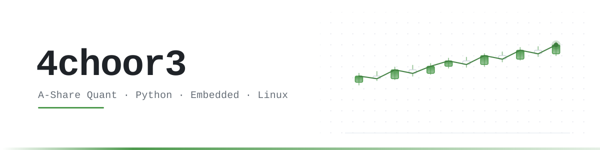

<picture>
  <source media="(prefers-color-scheme: dark)" srcset="assets/banner-dark.svg">
  <source media="(prefers-color-scheme: light)" srcset="assets/banner-light.svg">
  
</picture>

 

---

## 关于我

生物科学在读，写代码比做实验多。

- **A 股量化** —— Python 工具链处理前复权日线：数据清洗、因子构造、策略回测
- **Linux 日常** —— Arch 当主力系统，重复劳动一律交给脚本
- **折腾记录** —— 折腾过的东西都记在[博客](https://4choor3.github.io)

## 技术栈

<picture>
  <source media="(prefers-color-scheme: dark)" srcset="https://skillicons.dev/icons?i=py%2Clinux%2Carch%2Capple%2Cdocker%2Cgithub%2Cvscode%2Cblender&theme=dark&perline=8">
  <source media="(prefers-color-scheme: light)" srcset="https://skillicons.dev/icons?i=py%2Clinux%2Carch%2Capple%2Cdocker%2Cgithub%2Cvscode%2Cblender&theme=light&perline=8">
  
</picture>

## 项目

| 项目 | 是什么 | 技术栈 |
|:---|:---|:---|
| **[RP2040 Mini TXT Reader](https://github.com/4choor3/rp2040-txt-reader)** | 成本 ¥30 以内的口袋 TXT 阅读器：插上 Type-C 就是 U 盘，拖进 `book.txt` 开机即读，无需烧录 | CircuitPython · RP2040 · SPI · ST7735 |
| **[4choor3.github.io](https://4choor3.github.io)** | 个人博客，记录量化、Python 与工具折腾 | Hexo · GitHub Pages |

  
   ▲ RP2040 Mini TXT Reader · 圆周率演示与全套硬件接线

## 最近在忙

- **A 股行情数据管道** —— 7000+ 标的前复权日线：清洗、每日增量更新、缺失补齐
- **策略回测** —— backtrader 等框架上的历史回测与技术指标验证
- **脚本自动化** —— 把日常重复劳动都交给 Python

---

<i>我们无法预知某个瞬间的价值，直到它成为回忆。</i>

